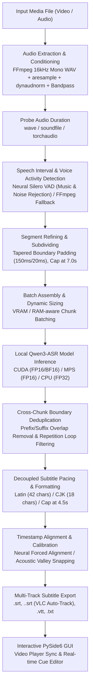

# SubtitleGo: Video Audio Extraction, Speech Recognition & Subtitle Pipeline Logic

This document details the end-to-end architecture, signal processing algorithms, and machine learning pipeline implemented in **SubtitleGo** to condition media streams, detect speech intervals, perform local offline Automatic Speech Recognition (ASR), and format timed, pacing-compliant subtitles.

---

## 1. High-Level Architecture Overview

SubtitleGo processes media files entirely offline on local hardware (NVIDIA CUDA, Apple Silicon MPS, or CPU). The pipeline decouples acoustic context windows for speech recognition from display cue pacing, ensuring maximum transcription accuracy while generating subtitles with natural reading cadence.



---

## 2. Step 1: Conditioned Audio Extraction & PTS Synchronization

*Source: `src/core/audio_processor.py` -> `extract_audio_to_wav()`*

Audio is extracted and conditioned prior to analysis to ensure consistent signal levels and eliminate acoustic anomalies:

### 2.1. FFmpeg Filter Chain
```bash
ffmpeg -hide_banner -loglevel error -y -i "<input_path>" \
    -vn -acodec pcm_s16le -ar 16000 -ac 1 \
    -af "highpass=f=120,lowpass=f=4000,dynaudnorm=f=75:g=15:m=4.0" \
    "<output_path>"
```

### 2.2. Audio Conditioning Components
- **Native Container PTS Preservation**: Extracts audio samples preserving native container timestamps without artificial padding or stretching, ensuring exact timestamp synchronicity between media playback and generated subtitle cues.
- **Vocal Bandpass (`highpass=f=120,lowpass=f=4000`)**: Cuts deep mechanical rumble (<120 Hz) and high-frequency electronic hiss (>4000 Hz), preserving the core frequencies required for human speech recognition.
- **Dynamic Audio Normalization (`dynaudnorm=f=75:g=15:m=4.0`)**: Continuously normalizes volume fluctuations without peak clipping. The maximum gain boost is calibrated to `m=4.0` (~12 dB) to ensure whispers are audible while preventing quiet background music and ambient soundtracks from being over-amplified into speech candidates.
- **Format Standard**: 16-bit little-endian uncompressed PCM (`pcm_s16le`), 16 kHz sample rate, mono channel (`ac=1`).
- **Resilience Fallback**: If the advanced filter graph is unsupported by an older FFmpeg binary, the pipeline automatically falls back to basic unconditioned extraction, and then to Python fallback backends (`soundfile`, `scipy.signal`, or `torchaudio`).

---

## 3. Step 2: Neural Silero Voice Activity Detection (VAD) & Smart Interval Segmentation

*Source: `src/core/audio_processor.py` -> `detect_speech_intervals_vad()` & `segment_audio_smart()`*

Instead of blindly cutting audio into arbitrary time slices or relying merely on decibel thresholds, SubtitleGo uses **Neural Voice Activity Detection (VAD)** powered by Silero VAD (`models/silero_vad.jit`).

### 3.1. Background Music & Non-Speech Rejection
- **True Vocal Discrimination**: Conventional decibel volume filters (such as FFmpeg's `silencedetect`) cannot distinguish between singing, instrumental tracks, piano chords, EDM beats, and spoken dialogue. Background music above `-38 dB` would be treated as speech, leading speech recognition models to hallucinate random phrases or repetitive lyrics.
- **Neural Phoneme Probability**: Silero VAD evaluates deep acoustic features across 30ms windows at 16 kHz. Audio frames with vocal probabilities below threshold (`0.50`) are rejected as non-speech. If an audio passage contains only background music, ambient sound effects, or instrumental cues, zero speech intervals are produced, completely eliminating non-speech hallucinations.
- **FFmpeg Resilience Fallback**: If PyTorch JIT or Silero VAD cannot be loaded, the pipeline automatically falls back to vocal-bandpassed FFmpeg silence detection (`highpass=f=180,lowpass=f=3500,silencedetect=noise=-38dB:d=0.30`).

### 3.2. Boundary Tapering & Overlap Suppression
- **Silence Boundary Padding (`boundary_padding_s = 0.15s`)**: When speech is bordered by true acoustic silence, a safety pad of +150 ms is added to preserve initial plosives (*p*, *t*, *k*) and trailing vocal decays without clipping.
- **Tapered Internal Subdivision Padding (20 ms)**: When long utterances are subdivided into chunks, internal cut boundaries between adjacent sub-spans use minimal padding (20 ms) rather than 250 ms. This eliminates the 500 ms acoustic window overlap that historically caused words near cut boundaries to be transcribed twice.
- **SpeechInterval Structured Metadata**: `SpeechInterval` tracks true acoustic speech bounds (`start`, `end`) separate from the extraction window (`pad_start`, `pad_end`), alongside intra-segment micro-pauses (`pauses`).
- **Short Speech Retention (`min_segment_duration = 0.25s`)**: Short affirmations, interjections, and brief words ($\ge 0.25s$) are retained while brief electrical pops (< 0.25s) are rejected.

### 3.3. Acoustic Energy Valley Subdivision & Complete Sentence Preservation
When uninterrupted speech exceeds target chunk durations ($5.5s - 7.0s$):
1. **No Mid-Word Cuts**: The pipeline scans a search window ($[t_{\text{target}} - 1.5s, t_{\text{target}} + 1.5s]$) across the short-time RMS energy envelope.
2. **Breath & Pause Trough Snapping**: The segment is divided at the local acoustic energy minimum (the quietest breath or between-word pause), keeping grammatical sentences and spoken phrases intact.

---

## 4. Step 3: Local Offline Speech Recognition (Qwen3-ASR)

*Source: `src/core/model_manager.py` & `src/core/transcription_worker.py`*

SubtitleGo uses **Qwen3-ASR** (1.7B parameter speech model) running locally on the user's machine.

### 4.1. Hardware Detection & Acceleration
`ModelManager` auto-detects system capabilities and selects the optimal compute backend:
- **NVIDIA GPU (CUDA)**: FP16 / BF16 inference with PyTorch Flash Attention and Scaled Dot-Product Attention (`SDPA`).
- **Apple Silicon (MPS)**: FP16 inference leveraging unified memory architecture.
- **CPU Mode**: FP32 execution for low-power or non-GPU environments.

### 4.2. Dynamic Batch Sizing
Inference batch size is dynamically adjusted based on detected hardware profile:

| Device Type | Available VRAM / RAM | Recommended Batch Size | Default Concurrency |
| :--- | :--- | :--- | :--- |
| **CUDA GPU** | $\ge 23\text{ GB}$ (RTX 3090/4090) | 32 chunks | 4 workers |
| **CUDA GPU** | $12\text{ GB} - 16\text{ GB}$ (RTX 4070/4080) | 16 chunks | 2 workers |
| **CUDA GPU** | $6\text{ GB} - 8\text{ GB}$ (RTX 2060/3060/4060) | 8 chunks | 2 workers |
| **CUDA GPU** | $4\text{ GB}$ entry VRAM | 4 chunks | 1 worker |
| **Apple Silicon (MPS)** | $\ge 32\text{ GB}$ Unified Memory | 16 chunks | 2 workers |
| **Apple Silicon (MPS)** | $16\text{ GB} - 24\text{ GB}$ Unified Memory | 8 chunks | 2 workers |
| **Apple Silicon (MPS)** | $8\text{ GB}$ Unified Memory | 2 chunks | 1 worker |
| **CPU Mode** | $\ge 16\text{ GB}$ System RAM | 4 chunks | 2 workers |
| **CPU Mode** | $8\text{ GB}$ System RAM | 2 chunks | 1 worker |

### 4.3. Fault Tolerance & Out-of-Memory (OOM) Recovery
- If a GPU batch encounters an OOM error, `ModelManager` immediately clears the VRAM cache and retries the batch **item-by-item** sequentially.
- On Apple Silicon MPS, if a single chunk exceeds memory limits, the manager hot-reloads the model onto **CPU mode** without terminating the active transcription job.

### 4.4. Fast Audio Loader Patch
`ModelManager.patch_qwen_asr_audio_loader()` monkey-patches Qwen3-ASR's internal audio loading to use C-based `soundfile` bindings. This eliminates Numba JIT warmup latency, avoids Librosa dependency overhead, and resolves Windows long-path file limits (`WinError 206`).

### 4.5. Language Support & Vocabulary Prompting
- Supports 52+ spoken languages and dialects, including automatic language detection.
- Supports domain hotwords / prompt keywords (`prompt`) to steer recognition of specialized technical terminology, acronyms, and proper nouns.

---

## 5. Step 4: Subtitle Alignment, Pacing & Multilingual Refinement

*Source: `src/core/subtitle_formatter.py` -> `refine_subtitles_for_pacing()`*

SubtitleGo decouples the ASR audio chunk size (`8.0s`) from the visual subtitle display pacing (`4.5s`). Once raw transcriptions are returned, `refine_subtitles_for_pacing()` formats them into optimal viewing cues.

### 5.1. Cross-Chunk Boundary Deduplication & Repetition Suppression
- **Acoustic Overlap Deduplication**: Extraction padding between adjacent chunks can cause speech near chunk boundaries to be recognized in both chunks. SubtitleGo's `deduplicate_raw_segments()` and `deduplicate_chunk_boundary()` detect prefix/suffix matches across adjacent chunks:
  - **Latin Scripts**: Word-level $n$-gram matching (comparing the trailing $k$ words of Chunk $N$ against the leading $k$ words of Chunk $N+1$). Overlapping prefix words are automatically stripped from Chunk $N+1$.
  - **CJK Scripts**: Character-level suffix/prefix matching (ignoring punctuation). Duplicate characters at the start of Chunk $N+1$ are cleanly removed.
- **Repetition Loop Suppression**: Speech recognition models can enter repetitive loops on low-confidence or silent audio (e.g. repeating a phrase 3+ times). `remove_repetition_loops()` collapses repeated clauses and CJK character loops to a single clean utterance.
- **Consecutive Duplicate Suppression**: A final pass in `refine_subtitles_for_pacing()` detects identical cue texts appearing within 2.0s of each other and eliminates the duplicate cue.

### 5.2. Script-Aware Character Limits
- **Latin Scripts (English, Spanish, French, German, etc.)**: Maximum `42 characters` per cue.
- **CJK Scripts (Chinese, Japanese, Korean)**: Maximum `18 characters` per cue.
  - CJK languages do not use whitespace to separate words, making word-count rules invalid. SubtitleGo uses character classification regex (`[\u4e00-\u9fff\u3040-\u30ff\uac00-\ud7af]`) to detect CJK content and apply appropriate reading constraints.

### 5.3. Neural Forced Alignment & Word/Token Timestamp Grouping
When forced alignment is active (`Qwen3ForcedAligner`), the model outputs millisecond-accurate timestamps for each word and CJK token. `_group_aligned_items_into_cues()` groups consecutive tokens into cues constrained by maximum line length, visual duration limits ($0.5s - 4.5s$), sentence ends, and conversational turnover pauses. Users can install the aligner via the Setup Wizard or Model Setup Dialog.

### 5.4. Acoustic Silence Gapping & Pause Snapping
When forced alignment is inactive, SubtitleGo uses high-precision acoustic snapping:
- **Speech-Anchored Cue Onset (`lead_in = 0.0s`)**: Cues are anchored strictly to the physical onset of speech, eliminating premature subtitle popping and preventing the text from racing ahead of audio.
- **True Acoustic Silence Gapping**: When a sentence or clause is split across an intra-utterance breath or pause (`p_start`, `p_end`), the preceding cue terminates at `p_start` (when speech ceases) and the next cue is deferred until `p_end` (when vocalization resumes). This maintains an empty on-screen interval during pauses rather than displaying the next cue early.
- **Proportional Fallback**: In the absence of an acoustic pause, duration is distributed proportionally by character weight across tightly bounded speech spans ($5.5s - 7.0s$) and clamped between `min_duration = 0.3s` and `max_duration = 4.5s`.

---

## 6. Step 5: Multi-Track Auto-Export & Queue Management

*Source: `src/core/queue_manager.py` -> `_auto_save_subtitles()` & `export_zip()`*

### 6.1. Concurrent Batch Queue
- `QueueManager` coordinates asynchronous processing of multiple media files via `TranscriptionWorker` (`QThread`).
- Supports concurrent jobs, real-time progress reporting, pause/stop/retry operations, and queue reordering.

### 6.2. VLC & Media Player Auto-Discovery Export
When auto-save is enabled, SubtitleGo saves subtitle tracks directly alongside the source media file following standard VLC/Plex/media player auto-discovery naming conventions:
- `<video_base_name>.<lang_code>.srt`: Language-tagged SubRip subtitle track (e.g. `video.en.srt`, `video.zh.srt`, `video.ja.srt`). Media players automatically identify the track language without creating duplicate unlabelled tracks.
- `<video_base_name>.<lang_code>.vtt`: Language-tagged WebVTT subtitle track for web and modern media players.
- `<video_base_name>.srt` / `<video_base_name>.vtt`: Clean fallback if language is undetermined.
- `<video_base_name>.<lang_code>.txt`: Plain text transcript with timestamps for archival or note-taking.
- **Batch Export**: `export_zip()` packages all completed subtitles across the queue into a single ZIP archive adhering to the same language-tagged naming schema.

---

## 7. Step 6: Interactive Desktop GUI & Cue Editor

*Source: `src/ui/widgets/`*

SubtitleGo provides a native PySide6 desktop interface for monitoring and editing subtitles:
- **Video Preview Player (`video_player.py`)**: Video playback with frame-accurate timeline scrubbing, playback rate control, and live subtitle overlay.
- **Interactive Cue Editor (`cue_editor.py` / `subtitle_editor_tab.py`)**:
  - Full table view of subtitle cues with editable start times, end times, durations, and text.
  - Keyboard shortcuts to split cues, merge cues, and re-index sequentially.
  - Raw editor view (`raw_view.py`) for direct SRT/VTT text editing with syntax validation.
- **Hardware & Environment Diagnostics (`diagnostics_dialog.py` / `setup_wizard_dialog.py`)**:
  - Real-time VRAM/RAM monitoring and CUDA/MPS status display.
  - Automated dependency verification and model weight downloader.

---

## 8. Summary of Configuration Parameters

| Parameter | Default Value | Location | Purpose |
| :--- | :--- | :--- | :--- |
| `VAD Model` | `Silero VAD (JIT)` | `models/silero_vad.jit` / `audio_processor.py` | Neural Voice Activity Detection rejecting music, instruments, and background noise |
| `silence_thresh_db` | `-38.0 dB` | `audio_processor.py` / `settings_panel.py` | Fallback volume threshold below which audio is classified as silence |
| `min_silence_duration` | `0.30 s` | `audio_processor.py` | Minimum silence duration for conversational turnover & sentence boundary detection |
| `max_speech_chunk_duration` | `7.0 s` | `audio_processor.py` / `transcription_worker.py` | Target speech chunk duration (subdivided at acoustic energy valleys) |
| `min_segment_duration` | `0.25 s` | `audio_processor.py` | Minimum duration required for an interval (retains short speech, drops pops) |
| `boundary_padding_s` | `0.15 s` (150 ms) | `audio_processor.py` / `transcription_worker.py` | Acoustic boundary safety padding for silence-bounded speech |
| `internal_padding_s` | `0.02 s` (20 ms) | `audio_processor.py` | Tapered boundary padding between contiguous subdivided chunks |
| `lead_in` | `0.0 s` (0 ms) | `subtitle_formatter.py` | Anchored strictly to acoustic speech onset to prevent pre-display racing |
| Audio Sample Rate | `16000 Hz` | `audio_processor.py` | Standard 16 kHz audio sampling rate for Qwen3-ASR |
| Audio Channels | `1` (Mono) | `audio_processor.py` | Single-channel PCM audio for optimal model efficiency |
| Audio Filters | `bandpass (120-4000Hz) + dynaudnorm(m=4.0)` | `audio_processor.py` | Audio conditioning chain for vocal isolation and controlled volume leveling |
| `max_segment_length` (Cue) | `4.5 s` | `settings_panel.py` / `subtitle_formatter.py` | Maximum on-screen display duration for a single subtitle cue |
| `min_cue_duration` | `0.3 s` | `subtitle_formatter.py` | Minimum duration for a single subtitle cue |
| `max_chars_latin` | `42` characters | `subtitle_formatter.py` | Maximum characters per subtitle line for Latin scripts |
| `max_chars_cjk` | `18` characters | `subtitle_formatter.py` | Maximum characters per subtitle line for CJK scripts |
| `concurrency` | `2` workers | `queue_manager.py` / `settings_panel.py` | Number of simultaneous media files transcribed |
