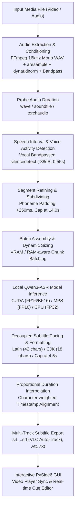

# SubtitleGo: Video Audio Extraction, Speech Recognition & Subtitle Pipeline Logic

This document details the end-to-end architecture, signal processing algorithms, and machine learning pipeline implemented in **SubtitleGo** to condition media streams, detect speech intervals, perform local offline Automatic Speech Recognition (ASR), and format timed, pacing-compliant subtitles.

---

## 1. High-Level Architecture Overview

SubtitleGo processes media files entirely offline on local hardware (NVIDIA CUDA, Apple Silicon MPS, or CPU). The pipeline decouples acoustic context windows for speech recognition from display cue pacing, ensuring maximum transcription accuracy while generating subtitles with natural reading cadence.



---

## 2. Step 1: Conditioned Audio Extraction & PTS Synchronization

*Source: `src/core/audio_processor.py` -> `extract_audio_to_wav()`*

Audio is extracted and conditioned prior to analysis to ensure consistent signal levels and eliminate acoustic anomalies:

### 2.1. FFmpeg Filter Chain
```bash
ffmpeg -hide_banner -loglevel error -y -i "<input_path>" \
    -vn -acodec pcm_s16le -ar 16000 -ac 1 \
    -af "aresample=async=1:first_pts=0,highpass=f=120,lowpass=f=4000,dynaudnorm=f=75:g=15:m=10.0" \
    "<output_path>"
```

### 2.2. Audio Conditioning Components
- **PTS Synchronization (`aresample=async=1:first_pts=0`)**: Resamples and locks audio samples to video Presentation Time Stamps (PTS). This prevents gradual audio/video desynchronization on Variable Frame Rate (VFR) recordings commonly captured by smartphones, webcams, and screen recorders.
- **Vocal Bandpass (`highpass=f=120,lowpass=f=4000`)**: Cuts deep mechanical rumble (<120 Hz) and high-frequency electronic hiss (>4000 Hz), preserving the core frequencies required for human speech recognition.
- **Dynamic Audio Normalization (`dynaudnorm=f=75:g=15:m=10.0`)**: Continuously normalizes volume fluctuations without peak clipping or distortion. Quiet whispers and distant speakers are brought to clear listening levels while loud speech is controlled.
- **Format Standard**: 16-bit little-endian uncompressed PCM (`pcm_s16le`), 16 kHz sample rate, mono channel (`ac=1`).
- **Resilience Fallback**: If the advanced filter graph is unsupported by an older FFmpeg binary, the pipeline automatically falls back to basic unconditioned extraction, and then to Python fallback backends (`soundfile`, `scipy.signal`, or `torchaudio`).

---

## 3. Step 2: Vocal-Bandpassed Silence Detection & Smart Interval Segmentation

*Source: `src/core/audio_processor.py` -> `detect_silence_intervals()` & `segment_audio_smart()`*

Instead of blindly cutting audio into arbitrary time slices, SubtitleGo uses **Voice Activity Detection (VAD)** powered by FFmpeg's `silencedetect` audio filter combined with vocal bandpass pre-filtering.

### 3.1. Filtered Silence & Conversational Turnover Detection
```text
highpass=f=180,lowpass=f=3500,silencedetect=noise=-38dB:d=0.30
```
- **Highpass (`180 Hz`)**: Eliminates low-frequency HVAC hums, traffic rumble, and instrumental sub-bass.
- **Lowpass (`3500 Hz`)**: Eliminates high-frequency sizzles and room echo above human vocal ranges.
- **`silencedetect=noise=-38dB:d=0.30`**: Identifies periods where vocal-range volume remains below `-38 dB` for at least `0.30 seconds` as a pause. This captures natural conversational turn-taking (where one speaker/character finishes talking and another begins) and sentence terminations without merging distinct speakers into run-on utterances.

### 3.2. Speech Inversion, Boundary Decoupling & Padding
- Silence boundaries (`silence_start`, `silence_end`) are inverted to extract active speech intervals `[current_pos, s_start]`.
- **Phoneme Safety Boundary Padding (`boundary_padding_s = 0.20s`)**: Every detected segment is padded by **+200 ms at the start** and **+200 ms at the end** strictly for the ASR audio extraction window:
  ```python
  pad_start = max(0.0, current_pos - boundary_padding_s)
  pad_end = min(total_duration, s_start + boundary_padding_s)
  ```
  This prevents clipping initial plosive consonants (e.g. *p*, *t*, *k*) and trailing word decays without leaking premature display lead-time into the visual subtitle timestamps.
- **SpeechInterval Structured Metadata**: `SpeechInterval` tracks true acoustic speech bounds (`start`, `end`) separate from the extraction window (`pad_start`, `pad_end`), alongside intra-segment micro-pauses (`pauses`).
- **Short Speech Retention (`min_segment_duration = 0.25s`)**: Short affirmations, interjections, and brief words ($\ge 0.25s$) are retained while brief electrical pops (< 0.25s) are rejected.

### 3.3. Acoustic Energy Valley Subdivision & Complete Sentence Preservation
When uninterrupted speech exceeds target chunk durations ($6.0s - 8.0s$):
1. **No Mid-Word Cuts**: The pipeline scans a search window ($[t_{\text{target}} - 1.5s, t_{\text{target}} + 1.5s]$) across the short-time RMS energy envelope.
2. **Breath & Pause Trough Snapping**: The segment is divided at the local acoustic energy minimum (the quietest breath or between-word pause), keeping grammatical sentences and spoken phrases intact.

---

## 4. Step 3: Local Offline Speech Recognition (Qwen3-ASR)

*Source: `src/core/model_manager.py` & `src/core/transcription_worker.py`*

SubtitleGo uses **Qwen3-ASR** (1.7B parameter speech model) running locally on the user's machine.

### 4.1. Hardware Detection & Acceleration
`ModelManager` auto-detects system capabilities and selects the optimal compute backend:
- **NVIDIA GPU (CUDA)**: FP16 / BF16 inference with PyTorch Flash Attention and Scaled Dot-Product Attention (`SDPA`).
- **Apple Silicon (MPS)**: FP16 inference leveraging unified memory architecture.
- **CPU Mode**: FP32 execution for low-power or non-GPU environments.

### 4.2. Dynamic Batch Sizing
Inference batch size is dynamically adjusted based on detected hardware profile:

| Device Type | Available VRAM / RAM | Recommended Batch Size | Default Concurrency |
| :--- | :--- | :--- | :--- |
| **CUDA GPU** | $\ge 23\text{ GB}$ (RTX 3090/4090) | 32 chunks | 4 workers |
| **CUDA GPU** | $12\text{ GB} - 16\text{ GB}$ (RTX 4070/4080) | 16 chunks | 2 workers |
| **CUDA GPU** | $6\text{ GB} - 8\text{ GB}$ (RTX 2060/3060/4060) | 8 chunks | 2 workers |
| **CUDA GPU** | $4\text{ GB}$ entry VRAM | 4 chunks | 1 worker |
| **Apple Silicon (MPS)** | $\ge 32\text{ GB}$ Unified Memory | 16 chunks | 2 workers |
| **Apple Silicon (MPS)** | $16\text{ GB} - 24\text{ GB}$ Unified Memory | 8 chunks | 2 workers |
| **Apple Silicon (MPS)** | $8\text{ GB}$ Unified Memory | 2 chunks | 1 worker |
| **CPU Mode** | $\ge 16\text{ GB}$ System RAM | 4 chunks | 2 workers |
| **CPU Mode** | $8\text{ GB}$ System RAM | 2 chunks | 1 worker |

### 4.3. Fault Tolerance & Out-of-Memory (OOM) Recovery
- If a GPU batch encounters an OOM error, `ModelManager` immediately clears the VRAM cache and retries the batch **item-by-item** sequentially.
- On Apple Silicon MPS, if a single chunk exceeds memory limits, the manager hot-reloads the model onto **CPU mode** without terminating the active transcription job.

### 4.4. Fast Audio Loader Patch
`ModelManager.patch_qwen_asr_audio_loader()` monkey-patches Qwen3-ASR's internal audio loading to use C-based `soundfile` bindings. This eliminates Numba JIT warmup latency, avoids Librosa dependency overhead, and resolves Windows long-path file limits (`WinError 206`).

### 4.5. Language Support & Vocabulary Prompting
- Supports 52+ spoken languages and dialects, including automatic language detection.
- Supports domain hotwords / prompt keywords (`prompt`) to steer recognition of specialized technical terminology, acronyms, and proper nouns.

---

## 5. Step 4: Subtitle Alignment, Pacing & Multilingual Refinement

*Source: `src/core/subtitle_formatter.py` -> `refine_subtitles_for_pacing()`*

SubtitleGo decouples the ASR audio chunk size (`8.0s`) from the visual subtitle display pacing (`4.5s`). Once raw transcriptions are returned, `refine_subtitles_for_pacing()` formats them into optimal viewing cues.

### 5.1. Script-Aware Character Limits
- **Latin Scripts (English, Spanish, French, German, etc.)**: Maximum `42 characters` per cue.
- **CJK Scripts (Chinese, Japanese, Korean)**: Maximum `18 characters` per cue.
  - CJK languages do not use whitespace to separate words, making word-count rules invalid. SubtitleGo uses character classification regex (`[\u4e00-\u9fff\u3040-\u30ff\uac00-\ud7af]`) to detect CJK content and apply appropriate reading constraints.

### 5.2. Neural Forced Alignment & Word/Token Timestamp Grouping
When forced alignment is active (`Qwen3ForcedAligner`), the model outputs millisecond-accurate timestamps for each word and CJK token. `_group_aligned_items_into_cues()` groups consecutive tokens into cues constrained by maximum line length, visual duration limits ($0.5s - 4.5s$), sentence ends, and conversational turnover pauses.

### 5.3. Acoustic Pause Snapping & Visual Lead-In Calibration
When forced alignment is inactive, SubtitleGo uses high-precision acoustic snapping:
- **Broadcast Standard Visual Lead-In (`lead_in = 60ms`)**: Advances cue onset by 60ms for optimal human reading perception without premature 250ms bleeding.
- **Acoustic Pause Snapping**: When a sentence is split at punctuation marks (`,`, `.`, `!`, `?`, `。`, `，`), the boundary is snapped to the nearest intra-chunk RMS energy valley/breath pause rather than relying solely on linear character ratio.
- **Proportional Fallback**: In the absence of an acoustic pause, duration is distributed proportionally by character weight and clamped between `min_duration = 0.3s` and `max_duration = 4.5s`.

---

## 6. Step 5: Multi-Track Auto-Export & Queue Management

*Source: `src/core/queue_manager.py` -> `_auto_save_subtitles()` & `export_zip()`*

### 6.1. Concurrent Batch Queue
- `QueueManager` coordinates asynchronous processing of multiple media files via `TranscriptionWorker` (`QThread`).
- Supports concurrent jobs, real-time progress reporting, pause/stop/retry operations, and queue reordering.

### 6.2. VLC & Media Player Auto-Discovery Export
When auto-save is enabled, SubtitleGo saves subtitle tracks directly alongside the source media file following standard VLC/media player auto-discovery naming conventions:
- `<video_base_name>.<lang_code>.srt`: Language-tagged SubRip subtitle track (e.g. `video.en.srt`, `video.zh.srt`, `video.ja.srt`). Resolved from the user's selected language in Settings if specified, or dynamically from the speech model's detected language. Falls back to `<video_base_name>.srt` if the language is unknown.
- `<video_base_name>.<lang_code>.vtt`: Language-tagged WebVTT subtitle track for web players.
- `<video_base_name>.<lang_code>.txt`: Plain text transcript with timestamps for archival or note-taking.
- **Batch Export**: `export_zip()` packages all completed subtitles across the queue into a single ZIP archive with language tags.

---

## 7. Step 6: Interactive Desktop GUI & Cue Editor

*Source: `src/ui/widgets/`*

SubtitleGo provides a native PySide6 desktop interface for monitoring and editing subtitles:
- **Video Preview Player (`video_player.py`)**: Video playback with frame-accurate timeline scrubbing, playback rate control, and live subtitle overlay.
- **Interactive Cue Editor (`cue_editor.py` / `subtitle_editor_tab.py`)**:
  - Full table view of subtitle cues with editable start times, end times, durations, and text.
  - Keyboard shortcuts to split cues, merge cues, and re-index sequentially.
  - Raw editor view (`raw_view.py`) for direct SRT/VTT text editing with syntax validation.
- **Hardware & Environment Diagnostics (`diagnostics_dialog.py` / `setup_wizard_dialog.py`)**:
  - Real-time VRAM/RAM monitoring and CUDA/MPS status display.
  - Automated dependency verification and model weight downloader.

---

## 8. Summary of Configuration Parameters

| Parameter | Default Value | Location | Purpose |
| :--- | :--- | :--- | :--- |
| `silence_thresh_db` | `-38.0 dB` | `audio_processor.py` / `settings_panel.py` | Volume threshold below which audio is classified as vocal silence |
| `min_silence_duration` | `0.30 s` | `audio_processor.py` | Minimum silence duration for conversational turnover & sentence boundary detection |
| `max_speech_chunk_duration` | `8.0 s` | `audio_processor.py` / `transcription_worker.py` | Target speech chunk duration (subdivided at acoustic energy valleys) |
| `min_segment_duration` | `0.25 s` | `audio_processor.py` | Minimum duration required for an interval (retains short speech, drops pops) |
| `boundary_padding_s` | `0.20 s` (200 ms) | `audio_processor.py` | Boundary safety padding added strictly for ASR acoustic extraction |
| `lead_in` | `0.06 s` (60 ms) | `subtitle_formatter.py` | Broadcast standard visual cognitive lead-in for on-screen cues |
| Audio Sample Rate | `16000 Hz` | `audio_processor.py` | Standard 16 kHz audio sampling rate for Qwen3-ASR |
| Audio Channels | `1` (Mono) | `audio_processor.py` | Single-channel PCM audio for optimal model efficiency |
| Audio Filters | `aresample + bandpass + dynaudnorm` | `audio_processor.py` | Audio conditioning chain for PTS sync, vocal isolation, and dynamic volume leveling |
| `max_segment_length` (Cue) | `4.5 s` | `settings_panel.py` / `subtitle_formatter.py` | Maximum on-screen display duration for a single subtitle cue |
| `min_cue_duration` | `0.3 s` | `subtitle_formatter.py` | Minimum duration for a single subtitle cue |
| `max_chars_latin` | `42` characters | `subtitle_formatter.py` | Maximum characters per subtitle line for Latin scripts |
| `max_chars_cjk` | `18` characters | `subtitle_formatter.py` | Maximum characters per subtitle line for CJK scripts |
| `concurrency` | `2` workers | `queue_manager.py` / `settings_panel.py` | Number of simultaneous media files transcribed |
